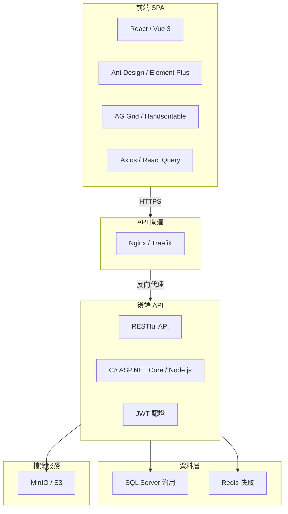
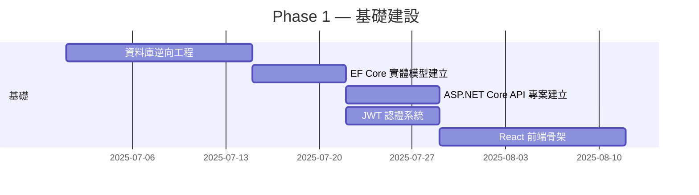
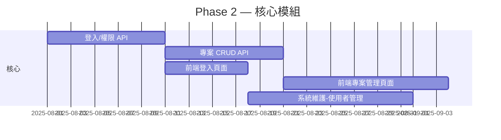
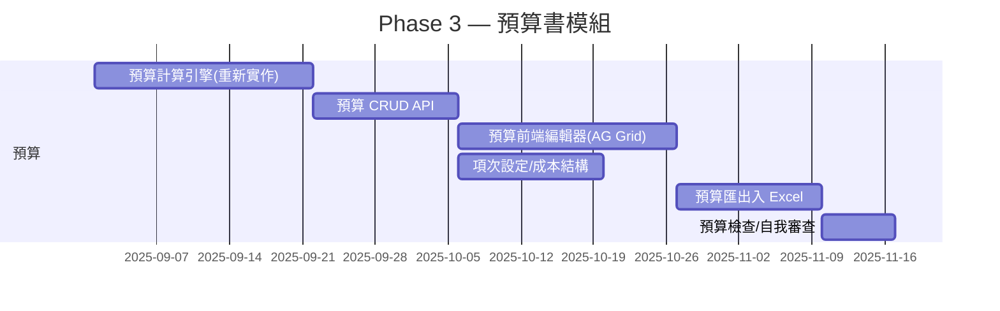
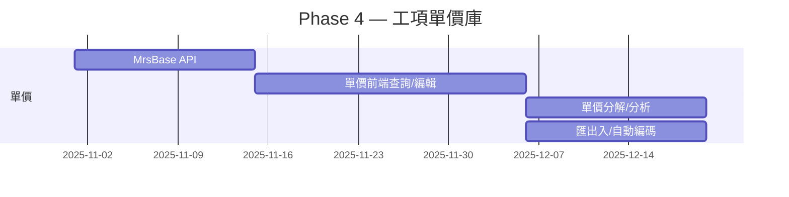
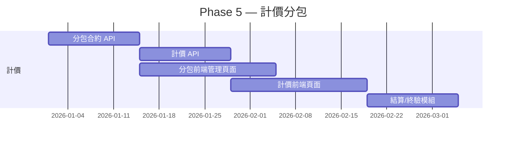
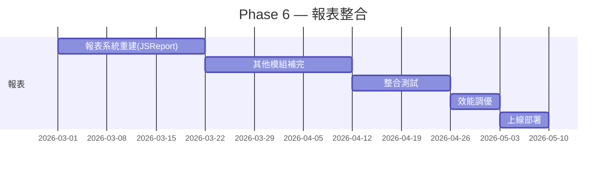

# PCCES 網頁版遷移規劃書

> 本規劃基於完整的源碼調研（見 `PCCES_源碼調研報告.md`），針對 **PCCES Win 4.3（公共工程電腦估算系統）** 由 .NET WinForms 桌面應用改寫為網頁版提出具體遷移方案。

---

## 目錄

1. [遷移策略總覽](#1-遷移策略總覽)
2. [技術架構建議](#2-技術架構建議)
3. [前端技術選型](#3-前端技術選型)
4. [後端技術選型](#4-後端技術選型)
5. [資料庫策略](#5-資料庫策略)
6. [封閉 DLL 替代方案](#6-封閉-dll-替代方案)
7. [分階段實施路線圖](#7-分階段實施路線圖)
8. [各模組遷移對照表](#8-各模組遷移對照表)
9. [風險與對策](#9-風險與對策)
10. [開發團隊建議](#10-開發團隊建議)

---

## 1. 遷移策略總覽

### 1.1 核心原則

| 原則 | 說明 |
|------|------|
| **業務邏輯重寫** | DomainModule DLL 無源碼 → 必須根據現有 UI 行為推導並重新實作 |
| **資料庫延用** | SQL Server 資料庫結構可保留，僅調整存取層 |
| **前端重建** | WinForms → 現代 SPA 框架，重寫所有 UI 互動 |
| **分階段上線** | 以模組為單位逐步遷移，避免大爆炸式上線 |
| **API 優先** | 先建立 RESTful API，前端透過 API 消費資料 |

### 1.2 整體遷移策略


---

## 2. 技術架構建議



### 2.1 推薦技術選型（方案 A — 全 C# 生態系）

| 層次 | 技術 | 理由 |
|------|------|------|
| **前端框架** | React 18 + TypeScript | 生態豐富、大型表格元件成熟 |
| **UI 元件庫** | Ant Design 5.x | 繁體中文支援佳、表格/表單完整 |
| **資料表格** | AG Grid（Enterprise 版） | 可替代 C1FlexGrid / Infragistics UltraWinGrid |
| **狀態管理** | React Query + Zustand | API 資料同步、客戶端狀態 |
| **後端框架** | ASP.NET Core 8 Web API | 與原有 C# 技術棧銜接、效能高 |
| **ORM** | Entity Framework Core | 與 SQL Server 最相容 |
| **認證** | JWT + Identity | 替代 Windows 整合驗證 |
| **報表** | JSReport / FastReport.NET Web | 替代 Crystal Reports |
| **Excel** | ClosedXML / EPPlus | 替代 Aspose.Cells（開源免費） |
| **PDF** | jsPDF（前端） / DinkToPdf（後端） | 替代 Adobe Acrobat ActiveX |

### 2.2 替代方案 B — 前後端分離（跨語言）

| 層次 | 技術 | 說明 |
|------|------|------|
| **前端** | React 18 + TypeScript | 同上 |
| **後端** | Node.js (NestJS) / Python (FastAPI) | 輕量 API |
| **ORM** | Prisma / SQLAlchemy | |
| **認證** | JWT | |

> **建議採用方案 A**，最大化重用團隊既有 C# 經驗。

---

## 3. 前端技術選型詳解

### 3.1 核心前端架構

```typescript
// 建議目錄結構
src/
├── api/               # API 呼叫層 (React Query hooks)
├── components/        # 共用元件
│   ├── Table/         # AG Grid 封裝
│   ├── Form/          # 表單封裝
│   ├── Tree/          # 樹狀目錄
│   └── Report/        # 報表檢視
├── features/          # 功能模組
│   ├── project/       # 專案管理
│   ├── budget/        # 預算書
│   ├── mrs/           # 工項單價庫
│   ├── invoice/       # 計價管理
│   └── admin/         # 系統維護
├── hooks/             # 自訂 hooks
├── stores/            # 狀態管理
├── types/             # TypeScript 定義
└── utils/             # 工具函式
```

### 3.2 關鍵技術對應

| WinForms 控制項 | 網頁版替代方案 | 注意事項 |
|----------------|--------------|---------|
| `C1FlexGrid` / `UltraWinGrid` | **AG Grid** | 行內編輯、排序、篩選、分頁、凍結欄位均支援 |
| `UltraTree` | **Ant Design Tree** | 節點選取、展開/收合、拖曳 |
| `UltraTabbedMdiManager` | **React Router + Ant Design Tabs** | 多分頁管理 |
| `UltraToolbars` | **Ant Design Menu + Dropdown** | 工具列按鈕 |
| `UltraStatusBar` | 自訂底部狀態列 | 輕量實作 |
| `Crystal Reports` | **JSReport** 或自訂 React 報表元件 | 需重新設計報表樣板 |
| `AcroPDF ActiveX` | **react-pdf** 或 **pdf.js** | PDF 預覽 |
| `C1Excel` / `Aspose.Cells` | **ExcelJS**（前端）或 **ClosedXML**（後端） | Excel 匯出入 |
| `UltraWinChart` | **ECharts** / **Ant Design Charts** | 圖表統計 |

---

## 4. 後端技術選型詳解

### 4.1 建議 API 設計

```csharp
// ASP.NET Core Web API 控制器風格
[ApiController]
[Route("api/v1/budget")]
[Authorize]
public class BudgetController : ControllerBase
{
    [HttpGet("{projectId}")]
    public async Task<ActionResult<BudgetDto>> GetBudget(
        string projectId,
        [FromQuery] string version = "latest")
    {
        // 預算書查詢
    }

    [HttpPost("{projectId}/items")]
    public async Task<ActionResult<BudgetItemDto>> AddItem(
        string projectId,
        [FromBody] CreateBudgetItemRequest request)
    {
        // 新增工項
    }

    [HttpPost("{projectId}/export/excel")]
    public async Task<ActionResult> ExportExcel(
        string projectId,
        [FromBody] ExportOptions options)
    {
        // Excel 匯出（使用 ClosedXML）
    }
}
```

### 4.2 業務邏輯層替代方案

由於原有 DomainModule DLL 無源碼，重新實作方案：

| 原 DLL | 重新實作方案 |
|--------|-------------|
| `Archnowledge.Pcces.DomainModule.Budget` | 參考 `frmBudget`、`Conversion` 等 UI 層行為推導業務邏輯 |
| `Archnowledge.Pcces.DomainModule.MrsBase` | 參考 `frmMrsBase`、`GridMrsBase` 行為 |
| `Archnowledge.Pcces.DomainModule.Bid` | 參考 `Conversion.cs` 中的轉換邏輯 |
| `Archnowledge.Pcces.DomainModule.Sub` / `SubChg` | 參考分包相關表單行為 |
| `Archnowledge.Pcces.DomainModule.CostStructure` | 參考 budget/option 設定 |
| `Archnowledge.Pcces.DatabaseAccess` | 改用 EF Core + Repository 模式 |
| `stdclass` | 重新實作 StaffClass、UserClass 等 |
| `budclass` | 重新實作預算計算類別 |
| `PowerClass` | 重新實作權限管理（改用 JWT + Policy） |
| `Archnowledge.Common` | 建立 Common 工具庫（UtilsHelper） |

---

## 5. 資料庫策略

### 5.1 資料庫沿用

- **保留 SQL Server** 為主要資料庫
- **保留現有資料表結構**（`Pcces` 資料庫），不修改 Schema
- 新增 `__EFMigrationsHistory` 表供 EF Core 使用

### 5.2 連線方式變更

| 現有 | 目標 |
|------|------|
| `Provider=SQLOLEDB.1;Integrated Security=SSPI` | `Server=host;Database=Pcces;User Id=webuser;Password=***` |
| OleDbConnection | SqlConnection (EF Core) |
| Windows 認證 | SQL 帳號認證或 Managed Identity |

### 5.3 快取層

- 引入 **Redis** 快取熱點資料（工項單價、項次設定、系統參數）
- 減少對 SQL Server 的直接查詢

---

## 6. 封閉 DLL 替代方案

### 6.1 逆向工程方式

對於無源碼的 DomainModule DLL，可採取以下策略：

| 策略 | 說明 | 適用場景 |
|------|------|---------|
| **行為推導** | 從 UI 表單程式碼中追蹤對 DLL 的呼叫參數與結果處理方式，反向推導業務邏輯 | 所有 DomainModule |
| **反編譯參考** | 使用 dnSpy / ILSpy 反編譯 DLL 獲取實作細節 | 取得演算法與商業規則 |
| **舊版對照** | 保留 WinForms 版作為參考實作，新功能依規格重新開發 | 複雜計算邏輯 |

> ⚠️ 反編譯僅供技術參考，不可直接複製程式碼用於商業目的。

### 6.2 優先重寫的關鍵邏輯

1. **預算計算引擎** — 加減項計算、浮動小數位處理、數量 x 單價 = 複價
2. **工項單價分析** — 工料機資源組合、單價分析表
3. **預算轉標單** — 預算書格式轉換為招標標單格式
4. **Excel 匯出引擎** — 各類報表格式匯出（25,897 行 Conversion.cs 的行為）
5. **權限驗證** — 功能權限、資料權限、角色管理

---

## 7. 分階段實施路線圖

### Phase 1：基礎建設（4-6 週）



**交付物**：
- [ ] 資料庫實體對應完成（EF Core DbContext）
- [ ] RESTful API 基礎架構（Swagger、認證、異常處理）
- [ ] 前端專案建立（Layout、路由、登入頁面）
- [ ] JWT 認證流程上線

### Phase 2：核心模組 — 登入 + 專案管理（4-6 週）



**交付物**：
- [ ] 登入/登出/權限功能
- [ ] 專案清單、新增、編輯、複製
- [ ] 系統使用者管理、角色權限設定

### Phase 3：核心業務 — 預算書模組（8-10 週）



**交付物**：
- [ ] 預算書新增/編輯/刪除/查詢
- [ ] 工項新增、編輯、排序、分層
- [ ] 數量計算、單價查詢、複價計算
- [ ] 項次設定（類別、格式）
- [ ] Excel 匯出（預算書格式）

### Phase 4：工項單價庫（6-8 週）



**交付物**：
- [ ] 工項單價查詢、編輯、搜尋
- [ ] 單價分析表（工料機組合）
- [ ] 單價匯入匯出 Excel
- [ ] 單價版本管理

### Phase 5：計價/分包模組（8-10 週）



**交付物**：
- [ ] 分包合約管理
- [ ] 計價請款流程（含圖形化）
- [ ] 分包結算、終驗
- [ ] 計價報表匯出

### Phase 6：報表/整合/上線（6-8 週）



**交付物**：
- [ ] 所有報表（計價報表、預算書、統計圖表）
- [ ] 單元測試覆蓋率 > 70%
- [ ] 效能測試報告
- [ ] 部署腳本與 CI/CD 流程

### 總時程預估：**8-10 個月**

---

## 8. 各模組遷移對照表

### 8.1 模組遷移優先序

| 優先序 | 模組 | 複雜度 | 依賴 | 建議 Phase |
|-------|------|--------|------|-----------|
| P0 | 登入/權限/系統維護 | 🟢 中低 | 無 | Phase 2 |
| P0 | 專案管理 | 🟢 中低 | 登入 | Phase 2 |
| P1 | **預算書** | 🔴 極高 | 專案、工項單價 | Phase 3 |
| P1 | **工項單價庫** | 🔴 高 | 無 | Phase 4 |
| P2 | **計價管理** | 🟡 中高 | 專案、分包 | Phase 5 |
| P2 | 分包合約 | 🟡 中 | 專案 | Phase 5 |
| P3 | 分包結算/終驗 | 🟡 中 | 分包 | Phase 5 |
| P3 | 報表系統 | 🔴 高 | 所有模組 | Phase 6 |
| P4 | 比較分析 | 🟢 低 | 工項單價 | Phase 6 |
| P4 | 台鐵專用模組 | 🟢 低 | 核心模組 | Phase 6 |
| P4 | 系統插件 | 🟢 低 | 核心模組 | Phase 6 |

### 8.2 WinForms → Web 對應原則

| WinForms 特性 | Web 對應策略 |
|--------------|-------------|
| 事件驅動 (Click、Validating) | React 狀態驅動（useState + useEffect） |
| Modal Dialog（ShowDialog） | Ant Design Modal / Drawer |
| 同步資料操作 | React Query 非同步 + Loading 狀態 |
| MDI 多文件介面 | React Router + Tabs 分頁管理 |
| OleDb 直接連線 | RESTful API（無狀態） |
| 雙向資料繫結 | 單向資料流（React 狀態 → UI） |
| 右鍵功能表 | Ant Design Dropdown / ContextMenu |

---

## 9. 風險與對策

### 9.1 風險矩陣

| 風險 | 可能性 | 影響 | 對策 |
|------|--------|------|------|
| **DomainModule DLL 無源碼** | 確定 | 🔴 致命 | 行為推導 + 反編譯參考 + 重新實作 |
| **商業邏輯複雜度被低估** | 🟡 高 | 🟡 中 | 優先實作最常用路徑，逐步補齊邊界案例 |
| **Conversion.cs 25K 行需完整理解** | 🟡 高 | 🟡 中 | 以測試驅動方式逐步實作匯出功能 |
| **Infragistics 特有行為無法完全複製** | 🟡 中 | 🟢 低 | 以使用者體驗優先，不追求 100% 像素級複製 |
| **資料庫結構不完整** | 🟢 低 | 🟡 中 | 從程式碼中推導關聯 |
| **使用者抗拒變更** | 🟡 中 | 🟡 中 | 漸進式上線、保留舊版並行使用 |
| **計算結果不一致** | 🟡 高 | 🔴 高 | 建立自動化比對測試（新舊版輸出比對） |

### 9.2 關鍵成功因素

- ✅ **建立自動化測試**：對每個核心計算邏輯撰寫測試案例，與舊版輸出比對
- ✅ **迭代式交付**：每 2 週一個可展示的功能增量
- ✅ **保留舊版並行**：在新版未完全驗證前，舊版繼續可用
- ✅ **API 先行**：先完成 API 開發與驗證，前端再串接

---

## 10. 開發團隊建議

### 10.1 團隊組成

| 角色 | 人數 | 技能要求 |
|------|------|---------|
| **專案經理** | 1 | 熟悉公共工程流程 |
| **後端工程師** | 2-3 | C# / ASP.NET Core / EF Core / SQL Server |
| **前端工程師** | 2-3 | React / TypeScript / AG Grid / Ant Design |
| **全端工程師** | 1-2 | 前後端皆可、擅長系統整合 |
| **QA 測試** | 1 | 自動化測試 + 與舊版比對 |
| **UI/UX 設計** | 1（兼職） | 熟悉工程系統介面設計 |

> **最小可行團隊**：1 後端 + 1 前端 + 1 全端，預估時程延長 30-50%。

### 10.2 開發工具建議

| 類別 | 工具 |
|------|------|
| **版本控制** | Git + GitHub / GitLab |
| **CI/CD** | GitHub Actions / GitLab CI |
| **容器化** | Docker + Docker Compose |
| **API 文件** | Swagger / Scalar |
| **資料庫管理** | Azure Data Studio / SSMS |
| **反向工程** | dnSpy / ILSpy（僅參考） |

---

## 附錄 A：資料表架構推斷

從 DBClass.cs 中 GetTableName（推測）及各表單 SQL 查詢可推斷主要資料表：

> 實際架構需在 Phase 1 進行資料庫逆向工程確認。

| 資料表 | 說明 |
|--------|------|
| `Project` / `Proj` | 專案主檔 |
| `BDGT_Main` / `BDGT_Item` | 預算主檔、預算工項 |
| `MrsBase_Main` / `MrsBase_Item` | 工項單價主檔、工項明細 |
| `MrsBase_Resource` | 工項資源（工料機） |
| `BDGT_Resource` | 預算資源分配 |
| `Inv_Main` / `Inv_Item` | 計價主檔、計價明細 |
| `Sub_Main` / `Sub_Item` | 分包主檔、分包明細 |
| `SysUser` / `SysGroup` / `SysFunc` | 系統使用者、群組、功能權限 |
| `SysCode` / `SysPara` | 系統編碼、系統參數 |
| `BDGT_Change` / `BDGT_ChangeItem` | 預算變更、變更明細 |

---

## 附錄 B：API 端點規劃（初步）

```
# 認證
POST   /api/v1/auth/login
POST   /api/v1/auth/refresh
POST   /api/v1/auth/logout

# 專案
GET    /api/v1/projects
GET    /api/v1/projects/{id}
POST   /api/v1/projects
PUT    /api/v1/projects/{id}
DELETE /api/v1/projects/{id}

# 預算書
GET    /api/v1/budget/{projectId}
GET    /api/v1/budget/{projectId}/items
POST   /api/v1/budget/{projectId}/items
PUT    /api/v1/budget/{projectId}/items/{itemId}
DELETE /api/v1/budget/{projectId}/items/{itemId}
POST   /api/v1/budget/{projectId}/calculate
POST   /api/v1/budget/{projectId}/export/excel
POST   /api/v1/budget/{projectId}/export/pdf
POST   /api/v1/budget/{projectId}/check

# 工項單價庫
GET    /api/v1/mrsbases
GET    /api/v1/mrsbases/{code}
GET    /api/v1/mrsbases/{code}/resources
POST   /api/v1/mrsbases
PUT    /api/v1/mrsbases/{code}
POST   /api/v1/mrsbases/import
POST   /api/v1/mrsbases/export

# 分包合約
GET    /api/v1/contracts
POST   /api/v1/contracts
PUT    /api/v1/contracts/{id}
GET    /api/v1/contracts/{id}/items

# 計價
GET    /api/v1/invoices?projectId={id}
POST   /api/v1/invoices
PUT    /api/v1/invoices/{id}
POST   /api/v1/invoices/{id}/approve

# 系統管理
GET    /api/v1/admin/users
POST   /api/v1/admin/users
PUT    /api/v1/admin/users/{id}
GET    /api/v1/admin/roles
POST   /api/v1/admin/roles
GET    /api/v1/admin/codes
PUT    /api/v1/admin/codes/{type}
```

---

> **文件版本**：v1.0  
> **更新日期**：2025-07  
> **下一步**：請確認本規劃後，可啟動 Phase 1 基礎建設開發。
